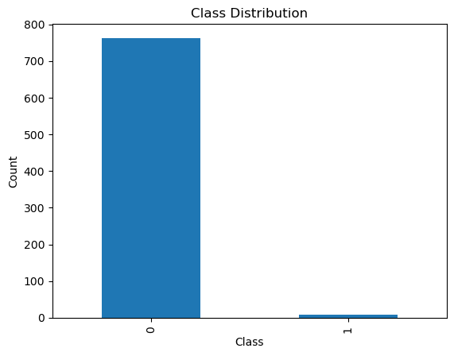
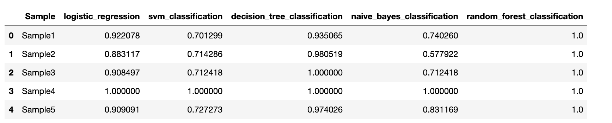

# Overview
## Sampling 

This repository contains Python code for implementing various sampling techniques on a credit card fraud dataset. The goal is to demonstrate how different sampling methods, specifically undersampling and oversampling, can be applied to balance imbalanced datasets.

## Dataset
The credit card fraud dataset used in this project is sourced from the following URL:
[Credit Card Fraud Dataset](https://github.com/AnjulaMehto/Sampling_Assignment/blob/main/Creditcard_data.csv)


The dataset consists of 772 rows and 31 columns, with features such as Time, V1-V28, Amount, and Class. The 'Class' column indicates whether a transaction is fraudulent (Class=1) or not (Class=0).

**Dependencies**
Before running the code, make sure to install the necessary Python libraries using the following:

```bash
pip install pandas numpy matplotlib
```

**Checking if Dataset is Balanced**
To check if the dataset is balanced or not, a bar graph is plotted using matplotlib.


<br/>

As we can see from the bar graph, the given dataset is not balanced so, we applied diffrent techniques for the same.

## Undersampling
Undersampling involves reducing the number of instances from the majority class to match the minority class. This is implemented using the Undersampling.ipynb Jupyter Notebook.<br/>

## Oversampling
Oversampling involves increasing the number of instances in the minority class to match the majority class. This is implemented using the Oversampling.ipynb Jupyter Notebook.<br/>

Jupyter Notebook demonstrates the creation of five different samples using various sampling techniques:
-**Simple Random Sampling:** Randomly selecting a specified number of instances from the dataset.
-**Stratified Sampling:** Creating samples from each class separately to maintain the original class distribution.
-**Cluster Sampling:** Dividing the dataset into clusters and selecting entire clusters randomly.
-**Systematic Sampling:** Selecting every k-th instance from the dataset.
-**Custom Sampling:** Implementing a custom sampling function that combines elements from both class 0 and class 1 in the final sample.

We applied the following models on our samples and calculated their acuuracies for each sample:
1)Logistic Regression
2)SVM
3)Decision Trees
4)Naive Bayes
5)Randon Forest

After that, we conducted an analysis wherein various models were applied to distinct samples, and subsequently, the accuracies for each model-sample combination were recorded and organized in a tabular format given below:<br/>




## Instructions for Use

Clone the repository:
```bash
git clone https://github.com/ananya-184/Sampling
```


Run the Jupyter Notebooks to explore the different sampling techniques.<br/>

Feel free to modify the code or experiment with your datasets.<br/>

Note: Ensure you have Python and Jupyter installed on your machine to run the notebooks.<br/>
